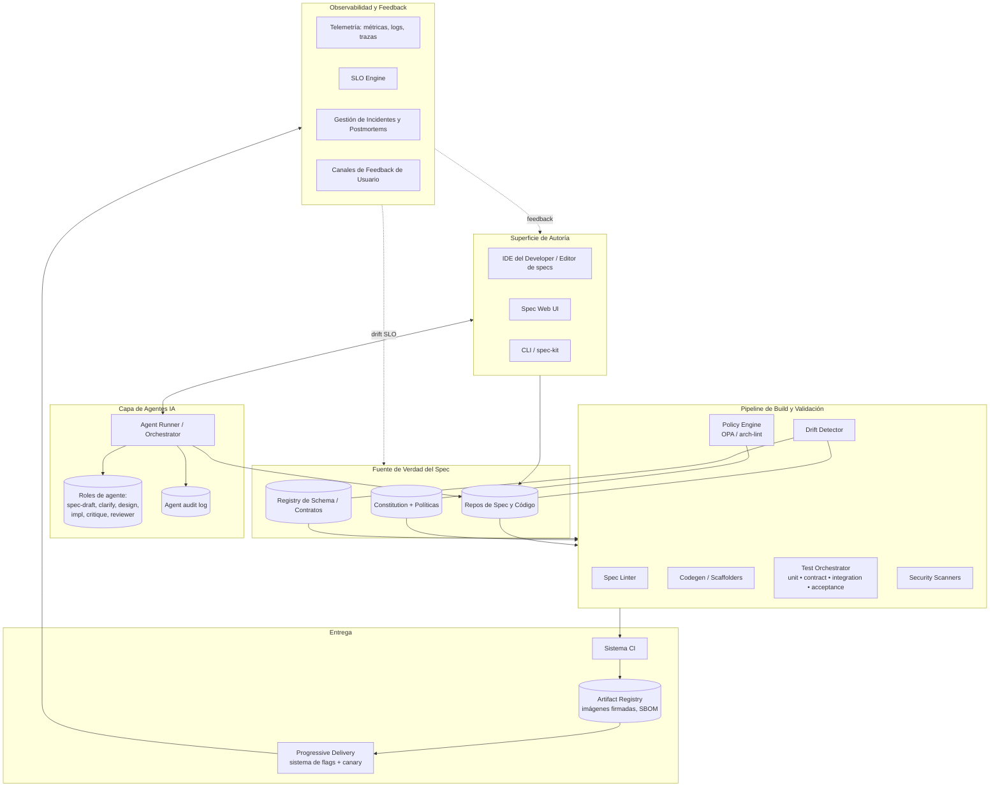
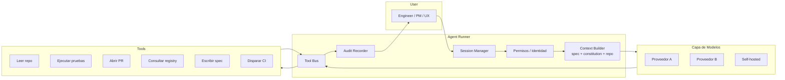

# Plataforma SDD — Arquitectura de Referencia

La plataforma que hace posible el SDLC SDD-First. Este documento define los componentes, sus responsabilidades, el flujo de datos desde el spec hasta las operations, y los límites de integración.

La plataforma es **infraestructura de camino pavimentado y opinionada**. Los squads solo pueden optar por no participar con waivers explícitos; la fricción es intencional.

---

## Tabla de Contenidos

1. [Objetivos de diseño](#objetivos-de-diseño)
2. [Arquitectura lógica](#arquitectura-lógica)
3. [Responsabilidades de los componentes](#responsabilidades-de-los-componentes)
4. [Flujo de datos: spec → code → test → deploy](#flujo-de-datos-spec--code--test--deploy)
5. [Capa de integración de agentes de IA](#capa-de-integración-de-agentes-de-ia)
6. [Modelo de almacenamiento y trazabilidad](#modelo-de-almacenamiento-y-trazabilidad)
7. [Build vs buy](#build-vs-buy)
8. [Topología de despliegue de referencia](#topología-de-despliegue-de-referencia)

---

## Objetivos de diseño

La plataforma está diseñada para estas propiedades, en orden de prioridad:

1. **Los specs son datos de primera clase** — consultables, enlazables, linteables, con control de versiones.
2. **Trazabilidad de extremo a extremo** — cualquier artefacto de producción puede rastrearse hasta un spec, diseño, tarea, prueba y aprobador humano.
3. **Los agentes de IA son observables** — cada prompt, llamada a herramienta y artefacto producido está registrado.
4. **La detección de drift es automática** — los humanos nunca tienen que preguntar "¿esto sigue sincronizado?"
5. **El inner loop es rápido** — feedback con sensación local en segundos.
6. **Reemplazar componentes, no la plataforma** — los límites entre componentes son estables; las implementaciones evolucionan.

## Arquitectura lógica



## Responsabilidades de los componentes

### Fuente de Verdad del Spec

El spec es contenido canónico en Git, junto al código que especifica. El **Registry de Schema/Contratos** almacena artefactos OpenAPI/proto/event-schema como objetos versionados de primera clase. La **Constitution + Políticas** almacena tanto el Markdown humano como el complemento legible por máquina (políticas OPA, reglas de lint).

Por qué Git: branching/merging, revisiones, trazabilidad, encaje cultural. Los specs que viven fuera de Git siempre derivan.

### Superficie de Autoría

- Los **plugins de IDE** integran la edición de specs donde trabajan los engineers. Muestran lints, sugerencias de agentes y hover-cards de trazabilidad.
- **Spec Web UI** para no-engineers (PM, UX, CX). Renderiza los specs de forma legible y proporciona autoría con los mismos lints.
- **CLI / spec-kit** para usuarios avanzados y automatización; las mismas operaciones que la UI están disponibles por línea de comandos.

Las tres superficies acceden a las mismas APIs y obedecen los mismos lints.

### Capa de Agentes IA

El **Agent Runner** es el corazón de la integración de agentes.

- Carga la constitution y el contexto relevante del repo/spec por sesión.
- Media el acceso a herramientas — solo herramientas permitidas por rol de agente.
- Escribe cada acción en el audit log: prompt, contexto recuperado, llamadas a herramientas, archivos modificados, aprobador.
- Aplica human-in-the-loop en operaciones de escritura según lo requiere la constitution.
- Proporciona **outputs tipificados** — los agentes emiten artefactos estructurados (borradores de specs, listas de tareas, PRs) que la plataforma puede validar.

Los roles de agente se definen declarativamente (system prompt, herramientas, disparadores de escalada). Los nuevos roles de agente pasan por el mismo proceso de revisión que el código.

### Pipeline de Build y Validación

- **Spec Linter** valida estructura y contenido (automatización G1, G2).
- **Codegen / Scaffolders** generan scaffolds desde spec/diseño (DTOs, controladores desde OpenAPI, event handlers desde schemas).
- **Test Orchestrator** ejecuta pruebas de unidad, contrato, integración y aceptación; produce el reporte de cobertura AC.
- **Drift Detector** ejecuta las cuatro drift checks (spec↔código, spec↔contrato, diseño↔código, constitution↔código).
- **Policy Engine** aplica políticas constitucionales en PRs y deploys.
- **Security Scanners** SAST/DAST/dep-scan, con resultados triados en una vista de seguridad única.

### Entrega

- **Sistema CI** ejecuta todo lo anterior en cada PR; las mismas verificaciones nuevamente en el RC.
- **Artifact Registry** almacena imágenes firmadas con attestaciones de SBOM y veredictos de políticas adjuntos.
- **Progressive Delivery** combina un servicio de feature flags (ej., self-hosted o vendedor) con un canary controller. El deploy spec impulsa la política de ramp.

### Observabilidad y Feedback

- **Telemetría** stack estándar (OpenTelemetry → métricas/logs/trazas). Dashboards derivados del spec aprovisionados automáticamente.
- **SLO Engine** rastrea SLIs contra SLOs declarados en los specs; abre issues cuando los error budgets se queman.
- **Gestión de Incidentes y Postmortems** integra page → bridge → timeline → postmortem; enlaza las acciones del postmortem con enmiendas de spec/constitution.
- **Canales de Feedback de Usuario** ingieren tickets de soporte, NPS y feedback interno del producto en el mismo backlog que la señal de ingeniería.

## Flujo de datos: spec → code → test → deploy

```mermaid
sequenceDiagram
    participant PM as PM Author
    participant Sp as Spec Repo
    participant AG as Agent Runner
    participant TL as Tech Lead
    participant Reg as Schema Registry
    participant CI as CI Pipeline
    participant AR as Artifact Registry
    participant Del as Progressive Delivery
    participant Obs as Observability

    PM->>Sp: Abre PR de spec borrador
    Sp->>AG: Lint de spec y clarify agent
    AG-->>PM: Hallazgos — brechas y clarificaciones
    PM->>Sp: Actualiza spec; merge tras G1 y G2
    TL->>Sp: Abre PR de diseño y tareas
    Sp->>Reg: Registra diffs de contratos
    Sp->>AG: Critique agent sobre el diseño
    AG-->>TL: Hallazgos de la crítica
    TL->>Sp: Merge tras G3

    loop Por cada tarea
        AG->>Sp: PR de implementación — TDD red, green, refactor
        CI->>Sp: Lint, tests, drift, policy checks
        TL->>Sp: Revisa y hace merge tras G4
    end

    CI->>AR: Build, firma, adjunta SBOM
    CI->>Sp: Validation report — G5
    AR->>Del: Promueve RC
    Del->>Obs: Canary luego ramp con SLO checks
    Obs->>Sp: Continuous spec health check
    Obs->>PM: Señal de usuario alimenta siguiente spec
```

El flujo es el mismo ya sea que un paso lo realice un humano, un agente o ambos.

## Capa de integración de agentes de IA

Una vista más detallada de la capa de agentes — donde la mayoría de las plataformas fallan.



Propiedades clave:

- **Identidad por sesión.** El agente actúa en nombre de un humano nombrado o una identidad de servicio nombrada. No hay agentes anónimos.
- **Lista de herramientas permitidas por rol.** Extraída de la constitution.
- **Verificaciones previas a la ejecución.** Antes de invocar una herramienta de escritura, el runner verifica las aprobaciones requeridas.
- **Auditoría posterior a la ejecución.** Cada acción registrada con snapshot del context window (o hash + log de recuperación recuperable).
- **Multi-proveedor.** Sin vendor lock-in en la capa de modelos. Enrutamiento por clase de tarea (ej., codegen vs revisión) y por sensibilidad.
- **Presupuesto de costo y latencia por sesión.** Presupuestos aplicados; los desbordamientos se registran y se revisan.

## Modelo de almacenamiento y trazabilidad

El grafo de trazabilidad es la columna vertebral de la plataforma:

```
Cláusula constitucional ──┐
                          ├── governa ──> Spec ──> Clarification log
                          │                │
                          │                ├──> Design ──> Task ──> PR ──> Commit ──> Test
                          │                │                                    └──> Code
                          │                └──> Acceptance test ──> Validation report
                          │                                            │
                          │                                            └──> Release ──> Deploy event
                          │                                                                │
                          └── aplicada-por ─> Policy ──> CI verdict          └──> Telemetry stream ──> Incident
```

Cada nodo tiene un ID estable. Cada arista es consultable. La plataforma expone este grafo como una API (ej., GraphQL) para que los dashboards, IDEs y herramientas de auditoría puedan navegarlo.

## Build vs buy

La mayoría de los componentes tienen opciones comerciales o OSS creíbles. Una topología de inicio razonable para 2026:

- **Fuente de verdad del spec:** Git (GitHub/GitLab). Herramientas: GitHub Spec Kit o convenciones del proyecto AWS Kiro, adaptados.
- **Schema registry:** Confluent Schema Registry (Kafka), Buf (proto), o un registry ligero hecho en casa para OpenAPI.
- **Agent runner de IA:** Construir sobre Claude Agent SDK / similar; integrar con la capa de plugin del IDE.
- **Test orchestrator:** Lo que proporcione el ecosistema de runtime (Vitest/Jest/PyTest), con una capa delgada de spec-binding.
- **Policy engine:** OPA / Conftest. Lints arquitectónicos mediante reglas personalizadas o proyectos equivalentes a ArchUnit.
- **CI:** GitHub Actions / Buildkite / similar. Reutilizar, no reemplazar.
- **Progressive delivery:** Argo Rollouts / Flagger / vendedor; LaunchDarkly/Unleash/OpenFeature para flags.
- **Observabilidad:** OpenTelemetry + un stack de tu elección.

Lo que debes **construir**: el spec linter (específico para tu schema de spec), el drift detector (específico para tu grafo de trazabilidad), el glue del agent runner (específico para tus herramientas y permisos), y la spec authoring UI para no-engineers. Aquí es donde está el valor diferencial.

## Topología de despliegue de referencia

Para una org de tamaño mediano que ejecuta esta plataforma:

- **Control plane** (multi-tenant dentro de la org): spec linter, drift detector, agent runner, API del grafo de trazabilidad. Con estado (Postgres para grafo, object store para artefactos), detrás de authn/authz.
- **Pipeline plane:** CI existente (por repo) que llama a los servicios del control plane para veredictos de spec/política/drift.
- **Authoring plane:** plugins de IDE (hablan con el control plane), web UI (habla con el control plane), CLI (habla con el control plane).
- **Telemetry plane:** stack de observabilidad estándar ingiriendo desde los servicios de los squads, más la propia telemetría del control plane.

El control plane es en sí mismo un producto — tiene un spec, un SLO, un runbook, un on-call. Ese equipo de platform se come su propia comida.

---

[← Overview](../overview-sp.md) · [Best Practices →](../best-practices/policies-sp.md)
