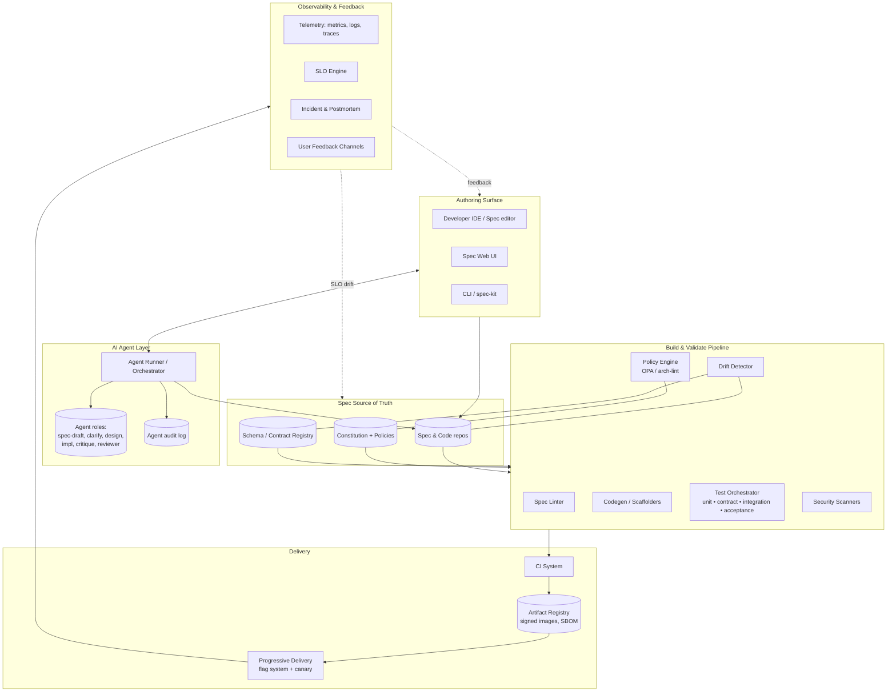
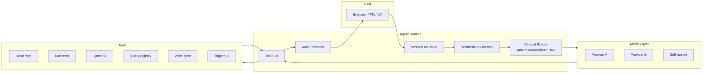

# SDD Platform — Reference Architecture

The platform that makes the SDD-First SDLC possible. This document defines the components, their responsibilities, the data flow from spec to operations, and integration boundaries.

The platform is **opinionated paved-road infrastructure**. Squads can opt out only with explicit waivers; the friction is intentional.

---

## Table of Contents

1. [Design goals](#design-goals)
2. [Logical architecture](#logical-architecture)
3. [Component responsibilities](#component-responsibilities)
4. [Data flow: spec → code → test → deploy](#data-flow-spec--code--test--deploy)
5. [AI agent integration layer](#ai-agent-integration-layer)
6. [Storage and traceability model](#storage-and-traceability-model)
7. [Build vs buy](#build-vs-buy)
8. [Reference deployment topology](#reference-deployment-topology)

---

## Design goals

The platform is designed for these properties, in priority order:

1. **Specs are first-class data** — queryable, linkable, lintable, version-controlled.
2. **End-to-end traceability** — any production artifact can be traced back to a spec, design, task, test, and human approver.
3. **AI agents are observable** — every prompt, tool call, and produced artifact is logged.
4. **Drift detection is automatic** — humans never have to ask "is this still in sync?"
5. **The inner loop is fast** — local-feeling feedback within seconds.
6. **Replace components, not the platform** — boundaries between components are stable; implementations evolve.

## Logical architecture



## Component responsibilities

### Spec Source of Truth

The spec is canonical content in Git, alongside the code it specifies. The **Schema/Contract Registry** stores OpenAPI/proto/event-schema artifacts as first-class versioned objects. The **Constitution + Policies** store both the human Markdown and the machine-readable companion (OPA policies, lint rules).

Why Git: branching/merging, reviews, traceability, cultural fit. Specs that live outside Git always drift.

### Authoring Surface

- **IDE plugins** integrate spec editing where engineers work. They surface lints, agent suggestions, and traceability hover-cards.
- **Spec Web UI** for non-engineers (PM, UX, CX). Renders specs read-friendly and provides authoring with the same lints.
- **CLI / spec-kit** for power users and automation; the same operations as the UI are available via command line.

All three surfaces hit the same APIs and obey the same lints.

### AI Agent Layer

The **Agent Runner** is the heart of agent integration.

- Loads the constitution and the relevant repo/spec context per session.
- Mediates tool access — only allowed tools per agent role.
- Writes every action to the audit log: prompt, retrieved context, tool calls, files changed, approver.
- Enforces human-in-the-loop on write operations as the constitution requires.
- Provides **typed outputs** — agents emit structured artifacts (spec drafts, task lists, PRs) the platform can validate.

Agent roles are defined declaratively (system prompt, tools, escalation triggers). New agent roles ship through the same review process as code.

### Build & Validate Pipeline

- **Spec Linter** validates structure and content (G1, G2 automation).
- **Codegen / Scaffolders** generate scaffolds from spec/design (DTOs, controllers from OpenAPI, event handlers from schemas).
- **Test Orchestrator** runs unit, contract, integration, and acceptance tests; produces the AC-coverage report.
- **Drift Detector** runs the four drift checks (spec↔code, spec↔contract, design↔code, constitution↔code).
- **Policy Engine** enforces constitutional policies on PRs and deploys.
- **Security Scanners** SAST/DAST/dep-scan, with results triaged into a single security view.

### Delivery

- **CI System** runs everything above on every PR; the same checks again on the RC.
- **Artifact Registry** stores signed images with SBOM attestations and policy verdicts attached.
- **Progressive Delivery** combines a feature-flag service (e.g., self-hosted or vendor) with a canary controller. The deploy spec drives ramp policy.

### Observability & Feedback

- **Telemetry** standard stack (OpenTelemetry → metrics/logs/traces). Spec-derived dashboards auto-provisioned.
- **SLO Engine** tracks SLIs against SLOs declared in specs; opens issues when error budgets burn.
- **Incident & Postmortem** integrates page → bridge → timeline → postmortem; links postmortem actions to spec/constitution amendments.
- **User Feedback Channels** ingest support tickets, NPS, and product-internal feedback into the same backlog as engineering signal.

## Data flow: spec → code → test → deploy

```mermaid
sequenceDiagram
    participant PM as PM (Author)
    participant Sp as Spec Repo
    participant AG as Agent Runner
    participant TL as Tech Lead
    participant Reg as Schema Registry
    participant CI as CI Pipeline
    participant Reg2 as Artifact Registry
    participant Del as Progressive Delivery
    participant Obs as Observability

    PM->>Sp: Open spec PR (draft)
    Sp->>AG: Spec lint + clarify-agent run
    AG-->>PM: Findings (gaps, clarifications)
    PM->>Sp: Update spec; merge after G1+G2
    TL->>Sp: Open design + tasks PR
    Sp->>Reg: Register contract diffs
    Sp->>AG: Critique-agent on design
    AG-->>TL: Critique findings
    TL->>Sp: Merge after G3

    loop For each task
        AG->>Sp: Implementation PR (TDD: red→green→refactor)
        CI->>Sp: Lint, test, drift, policy checks
        TL->>Sp: Review + merge after G4
    end

    CI->>Reg2: Build, sign, attach SBOM
    CI->>Sp: Validation report (G5)
    Reg2->>Del: Promote RC
    Del->>Obs: Canary → ramp with SLO checks
    Obs->>Sp: Spec health continuous check
    Obs->>PM: User signal → next spec
```

The flow is the same whether a step is taken by a human, an agent, or both.

## AI agent integration layer

A more detailed look at the agent layer — where most platforms fail.



Key properties:

- **Identity per session.** The agent acts on behalf of a named human or a named service identity. No anonymous agents.
- **Tool allowlist per role.** Pulled from the constitution.
- **Pre-execution checks.** Before invoking a write tool, the runner checks for required approvals.
- **Post-execution audit.** Every action recorded with context window snapshot (or hash + retrievable retrieval log).
- **Multi-provider.** No vendor lock-in at the model layer. Routing by task class (e.g., codegen vs review) and by sensitivity.
- **Cost and latency budget per session.** Budgets enforced; overruns logged and reviewed.

## Storage and traceability model

The traceability graph is the backbone of the platform:

```
Constitution clause ──┐
                      ├── governs ──> Spec ──> Clarification log
                      │                │
                      │                ├──> Design ──> Task ──> PR ──> Commit ──> Test
                      │                │                                    └──> Code
                      │                └──> Acceptance test ──> Validation report
                      │                                            │
                      │                                            └──> Release ──> Deploy event
                      │                                                                │
                      └── enforced-by ─> Policy ──> CI verdict                          └──> Telemetry stream ──> Incident
```

Every node has a stable ID. Every edge is queryable. The platform exposes this graph as an API (e.g., GraphQL) so dashboards, IDEs, and audit tooling can navigate it.

## Build vs buy

Most components have credible commercial or OSS options. A reasonable 2026 starting topology:

- **Spec source of truth:** Git (GitHub/GitLab). Tooling: GitHub Spec Kit or AWS Kiro project conventions, adapted.
- **Schema registry:** Confluent Schema Registry (Kafka), Buf (proto), or a lightweight homegrown registry for OpenAPI.
- **AI agent runner:** Build on top of Claude Agent SDK / similar; integrate with your IDE plugin layer.
- **Test orchestrator:** Whatever your runtime ecosystem provides (Vitest/Jest/PyTest), with a thin spec-binding layer.
- **Policy engine:** OPA / Conftest. Architectural lints via custom rules or projects like ArchUnit-equivalents.
- **CI:** GitHub Actions / Buildkite / similar. Reuse, don't replace.
- **Progressive delivery:** Argo Rollouts / Flagger / vendor; LaunchDarkly/Unleash/OpenFeature for flags.
- **Observability:** OpenTelemetry + a stack of your choice.

What you should **build**: the spec linter (specific to your spec schema), the drift detector (specific to your traceability graph), the agent runner glue (specific to your tools and permissions), and the spec authoring UI for non-engineers. These are where the moat is.

## Reference deployment topology

For a medium-sized org running this platform itself:

- **Control plane** (multi-tenant within the org): spec linter, drift detector, agent runner, traceability graph API. Stateful (Postgres for graph, object store for artifacts), behind authn/authz.
- **Pipeline plane:** existing CI (per repo) calling out to control-plane services for spec/policy/drift verdicts.
- **Authoring plane:** IDE plugins (talk to control plane), web UI (talks to control plane), CLI (talks to control plane).
- **Telemetry plane:** standard observability stack ingesting from squads' services, plus the control plane's own telemetry.

The control plane is itself a product — it has a spec, an SLO, a runbook, an on-call. That platform team eats its own food.

---

[← Overview](../overview.md) · [Best Practices →](../best-practices/policies.md)
