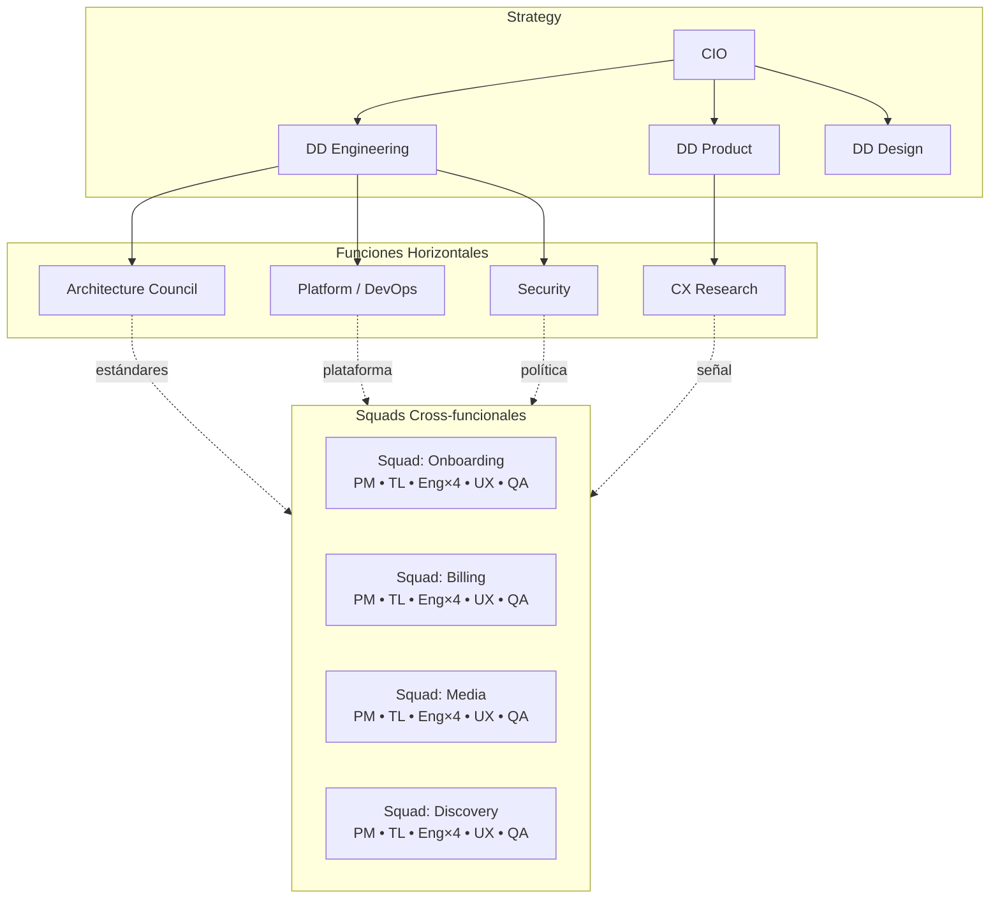

# Modelo de Squads

La organización se estructura como **squads cross-funcionales** con límites de propiedad claros, respaldados por funciones horizontales de **platform** y **architecture**.

---

## Tabla de Contenidos

1. [Por qué squads](#por-qué-squads)
2. [Composición estándar del squad](#composición-estándar-del-squad)
3. [Límites de propiedad](#límites-de-propiedad)
4. [Diagrama organizacional](#diagrama-organizacional)
5. [Patrones de interacción](#patrones-de-interacción)
6. [Escalar el modelo](#escalar-el-modelo)
7. [Anti-patterns](#anti-patterns)

---

## Por qué squads

Un squad cross-funcional lleva un problema desde el spec hasta operations sin cruzar límites organizacionales en el camino crítico. Esto es esencial para SDD: los specs cruzan límites de disciplina (Product/Eng/UX/QA), y una org fragmentada convierte la autoría de specs en una danza de traspasos de varias semanas.

Los squads también localizan los ciclos de feedback: las personas que escriben el spec son las personas que operan el servicio, por lo que los incentivos mal alineados entre "construirlo" y "operarlo" desaparecen.

## Composición estándar del squad

Un squad estándar tiene **6–9 personas**:

- 1 Product Manager
- 1 Engineering Manager (frecuentemente cumple el rol de Tech Lead en menor escala)
- 1 Tech Lead (cuando el EM no asume el doble rol)
- 3–5 Engineers (full-stack, con fortalezas específicas)
- 1 UX Designer (completo o compartido dependiendo de la superficie de usuario)
- 1 QA / Quality Engineer (frecuentemente compartido 1:2 squads)
- Flota de agentes de IA asignada por Platform — no es headcount sino capacidad

Los squads más grandes fragmentan el foco; los squads más pequeños no pueden sostener el on-call. Dos pizzas sigue siendo correcto para el trabajo SDD-first porque la calidad del spec depende del contexto compartido.

El squad tiene una **rotación de on-call nombrada** para los servicios que posee. No existe un "equipo de ops" que posea los servicios del squad en producción.

## Límites de propiedad

Cada squad posee una porción claramente delimitada del producto y la plataforma:

- **Dominios.** Un squad posee uno o más dominios de producto (ej., "Onboarding", "Billing"). Los specs en el dominio del squad corresponden al squad por defecto.
- **Servicios.** Cada servicio en runtime tiene exactamente un squad propietario. Los servicios con múltiples propietarios son un anti-pattern.
- **Specs.** Cada spec lista un squad propietario. Los specs cross-squad designan un propietario principal y un squad contribuyente.
- **Schemas/contratos.** Cada contrato público tiene un squad propietario; los cambios requieren su aprobación.

Los límites están documentados en un `ownership.yaml` legible por máquina que consume la plataforma — la búsqueda de código, el paginado de on-call y el enrutamiento de revisiones lo utilizan.

## Diagrama organizacional

Architecture, Platform, Security y CX Research son **horizontales** — no poseen dominios de producto. Sirven a los squads a través de la plataforma, la constitution y los estándares.

## Patrones de interacción

Tomando prestado de Team Topologies, con ajustes para SDD:

- **Squads alineados a flujo.** El tipo por defecto. Cross-funcionales, poseen un dominio de producto de extremo a extremo.
- **Equipo(s) de platform.** Construyen y operan la plataforma SDD. Proporcionan el camino pavimentado.
- **Equipo(s) habilitador(es).** Architecture y Security principalmente. Se integran temporalmente con los squads para elevar la capacidad, luego se van.
- **Equipos de subsistemas complejos.** Poco comunes. Se usan para dominios técnicos genuinamente profundos (ej., el core de búsqueda/ranking, el stack de medios en tiempo real). Exponen un contrato; los squads alineados a flujo lo consumen.

Modos de interacción:

- **X-as-a-Service.** Platform → Squads. Los squads consumen la plataforma SDD como cualquier servicio interno.
- **Colaboración.** Squad ↔ Squad en un spec transversal. Con límite de tiempo; de lo contrario, es tiempo de refactorizar la propiedad.
- **Facilitación.** Architecture/CX Research con un squad en un spec específico.

La plataforma hace seguimiento del tiempo de colaboración cross-squad; si domina la capacidad del squad, el límite es incorrecto.

## Escalar el modelo

**Org pequeña (≤30 engineers).** 2–4 squads. Un platform engineer (o compartido). Architecture es "los engineers más senior en una reunión recurrente". La constitution es un único repo a nivel de org. La flota de agentes de IA es compartida.

**Org mediana (30–150 engineers).** Marco completo. Squad de Platform dedicado. Tribus con rotaciones de on-call compartidas y constitutions parciales. Agent runner multi-tenant con presupuestos de costo por tribu. Architecture Council formalizado; se reúne quincenalmente.

**Org grande (150+ engineers).** Federar. Varias tribus; equipos de platform a nivel de tribu más un equipo de platform a nivel de org. Architecture federada (estándares a nivel de org, patrones a nivel de tribu). Gestión de specs explícitamente multi-repo con grafo de trazabilidad global. Flotas de agentes de IA por tribu compartiendo herramientas y audit trail. Las auditorías trimestrales de límites se vuelven no negociables; los squads mal alineados son reorganizados.

Los modos de falla al escalar son generalmente sobre **deriva de límites**, no de headcount. El marco requiere una auditoría trimestral de límites a cualquier escala.

## Anti-patterns

- **Equipos de componentes.** Un "equipo frontend" y un "equipo backend" que reciben cada uno la mitad de un spec. Lento, propenso a errores, mata el SDD.
- **Equipos de proyecto.** Squads formados por proyecto y disueltos después. Sin propiedad duradera; los specs se vuelven obsoletos.
- **Servicios compartidos sin propietario.** Un servicio usado por muchos squads pero sin dueño. El equipo platform *no* es el propietario por defecto.
- **Especialistas integrados "permanentemente temporales".** Un security engineer integrado permanentemente en un squad se convierte en un punto único de falla y deja de escalar Security como función.
- **Architects que no revisan diseños.** Se desconectan de la realidad; la constitution se desalinea.

---

[← Roles](roles-sp.md) · [RACI →](raci-sp.md)
