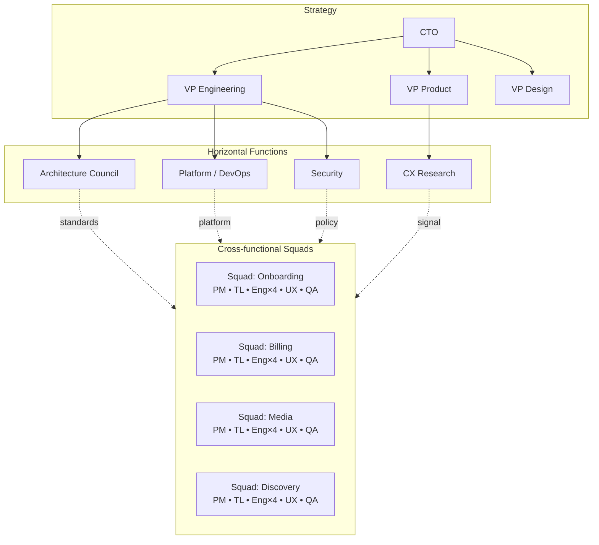

# Squad Model

The org is organized as **cross-functional squads** with clear ownership boundaries, supported by horizontal **platform** and **architecture** functions.

---

## Table of Contents

1. [Why squads](#why-squads)
2. [Standard squad composition](#standard-squad-composition)
3. [Ownership boundaries](#ownership-boundaries)
4. [Org diagram](#org-diagram)
5. [Interaction patterns](#interaction-patterns)
6. [Scaling the model](#scaling-the-model)
7. [Anti-patterns](#anti-patterns)

---

## Why squads

A cross-functional squad takes a problem from spec to operations without crossing organizational boundaries on the critical path. This is essential for SDD: specs cross discipline boundaries (Product/Eng/UX/QA), and a fragmented org turns spec authoring into a multi-week handoff dance.

Squads also localize feedback loops: the people who write the spec are the people who run the service, so misaligned incentives between "build it" and "operate it" disappear.

## Standard squad composition

A standard squad is **6–9 people**:

- 1 Product Manager
- 1 Engineering Manager (often plays Tech Lead at smaller scale)
- 1 Tech Lead (where EM doesn't double up)
- 3–5 Engineers (full-stack, with strengths)
- 1 UX Designer (full or shared depending on user surface)
- 1 QA / Quality Engineer (often shared 1:2 squads)
- AI agent fleet allocated by Platform — not headcount but capacity

Larger squads fragment focus; smaller squads can't sustain on-call. Two-pizza is still right for SDD-first work because spec quality depends on shared context.

The squad has a **named on-call rotation** for the services it owns. There is no "ops team" that owns squad services in production.

## Ownership boundaries

Each squad owns a clearly delimited slice of the product and platform:

- **Domains.** A squad owns one or more product domains (e.g., "Onboarding," "Billing"). Specs in the squad's domain default to the squad.
- **Services.** Each runtime service has exactly one owning squad. Multi-owner services are an anti-pattern.
- **Specs.** Each spec lists an owning squad. Cross-squad specs designate a primary owner and a contributing squad.
- **Schemas/contracts.** Each public contract has an owning squad; changes require their approval.

Boundaries are documented in a machine-readable `ownership.yaml` consumed by the platform — code-search, on-call paging, and review-routing all use it.

## Org diagram

Architecture, Platform, Security, and CX Research are **horizontals** — they don't own product domains. They serve squads through the platform, the constitution, and standards.

## Interaction patterns

Borrowing from Team Topologies, with adjustments for SDD:

- **Stream-aligned squads.** The default. Cross-functional, own a product domain end-to-end.
- **Platform team(s).** Build and run the SDD platform. Provide the paved road.
- **Enabling team(s).** Architecture and Security primarily. Embed temporarily with squads to lift capability, then leave.
- **Complicated subsystem teams.** Rare. Used for genuinely deep technical domains (e.g., the search/ranking core, the realtime media stack). They expose a contract; stream-aligned squads consume it.

Interaction modes:

- **X-as-a-Service.** Platform → Squads. Squads consume the SDD platform like any internal service.
- **Collaboration.** Squad ↔ Squad on a cross-cutting spec. Time-boxed; otherwise an ownership refactor is overdue.
- **Facilitating.** Architecture/CX Research with a squad on a specific spec.

The platform tracks cross-squad collaboration time; if it dominates squad capacity, the boundary is wrong.

## Scaling the model

**Small org (<30 engineers).** 2–4 squads. One platform engineer (or shared). Architecture is "the most senior engineers in a recurring meeting." Constitution is a single repo at the org level. AI agent fleet is shared.

**Medium org (30–150 engineers).** 5–15 squads, organized into **tribes** (groups of related squads sharing a customer journey or technical domain). Dedicated Platform squad. Architecture Council is formal. Constitution is layered: org-level + tribe-level + repo-level, all referenced from each spec.

**Large org (150+ engineers).** Multiple tribes; tribe-level platform teams plus an org-level platform team. Federated architecture (org-level standards, tribe-level patterns). Spec management explicitly multi-repo with cross-repo traceability. AI agent fleets per tribe with shared tooling and shared audit trail. Strict ownership in `ownership.yaml`.

Scaling failure modes are usually about **boundary drift**, not headcount. The framework requires a quarterly boundary audit at every scale.

## Anti-patterns

- **Component teams.** A "frontend team" and a "backend team" each receiving half a spec. Slow, error-prone, kills SDD.
- **Project teams.** Squads spun up per project and disbanded after. No durable ownership; specs go stale.
- **Shared services with no owner.** A service used by many squads but owned by none. The platform team is *not* the default owner.
- **Embedded specialists "permanently temporary."** A security engineer permanently embedded in a squad becomes a single point of failure and stops scaling Security as a function.
- **Architects who don't review designs.** They become disconnected from reality; the constitution drifts.

---

[← Roles](roles.md) · [RACI →](raci.md)
