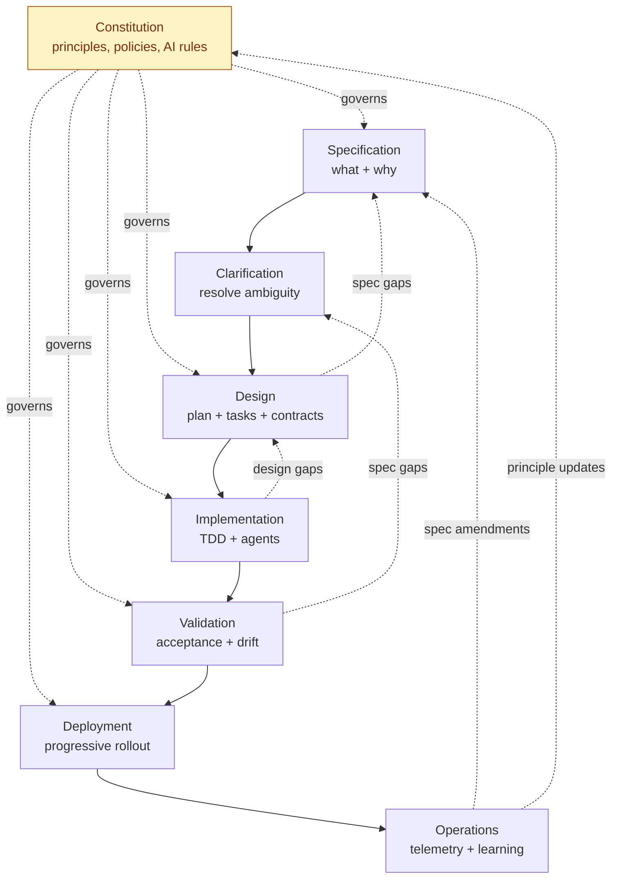
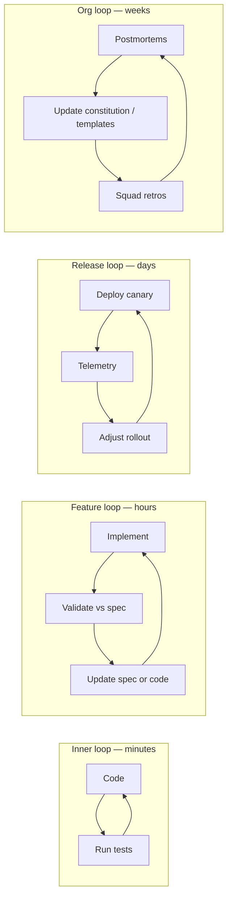

# SDLC Lifecycle

Flujo end-to-end del SDLC SDD-First. Cada etapa tiene su propio documento de profundización enlazado abajo.

---

## Tabla de Contenidos

1. [De un vistazo](#de-un-vistazo)
2. [Etapas](#etapas)
3. [Diagrama del lifecycle](#diagrama-del-lifecycle)
4. [Quality gates](#quality-gates)
5. [Ciclos de retroalimentación](#ciclos-de-retroalimentación)
6. [Rutas ligeras](#rutas-ligeras)
7. [Cadencia e iteración](#cadencia-e-iteración)

---

## De un vistazo

El lifecycle tiene **ocho etapas**, cada una con inputs, outputs, gates y dueños explícitos.

| # | Etapa | Output principal | Gate hacia la siguiente etapa |
|---|---|---|---|
| 0 | [Constitution](stages/constitution-sp.md) | Principios y políticas versionadas | Revisado y ratificado |
| 1 | [Specification](stages/specification-sp.md) | Spec aprobada de feature (`spec.md`) | Pasa el checklist de calidad de spec |
| 2 | [Clarification](stages/clarification-sp.md) | Log de ambigüedad resuelta | Cero items `MUST-CLARIFY` abiertos |
| 3 | [Design](stages/design-sp.md) | Diseño técnico (`design.md`) + desglose de tareas | Pasa la revisión de arquitectura |
| 4 | [Implementation](stages/implementation-sp.md) | Código + pruebas unitarias (TDD) | Todas las tareas cerradas, tests verdes |
| 5 | [Validation](stages/validation-sp.md) | Resultados de tests de aceptación, reporte de drift | Aceptación pasa + cero drift |
| 6 | [Deployment](stages/deployment-sp.md) | Artefacto liberado, rollout progresivo | SLOs saludables, rollout completo |
| 7 | [Operations](stages/operations-sp.md) | Telemetría, postmortems, enmiendas a la spec | Lecciones reincorporadas a la spec/constitution |

La Etapa 0 es **permanente**: la constitution existe una vez por producto/repo y evoluciona continuamente. Las Etapas 1–7 corren por feature.

## Etapas

Cada etapa está documentada en detalle. Haz clic para revisar:

- [Constitution](stages/constitution-sp.md) — principios, reglas de agentes de IA, gobernanza
- [Specification](stages/specification-sp.md) — qué construir y por qué
- [Clarification](stages/clarification-sp.md) — eliminar ambigüedad antes del diseño
- [Design](stages/design-sp.md) — plan técnico, contratos, desglose de tareas
- [Implementation](stages/implementation-sp.md) — construcción guiada por TDD con agentes de IA
- [Validation](stages/validation-sp.md) — aceptación, quality gates, detección de drift
- [Deployment](stages/deployment-sp.md) — entrega progresiva, aplicación de políticas
- [Operations](stages/operations-sp.md) — observabilidad y el ciclo de aprendizaje

## Diagrama del lifecycle

## Quality gates

Un **gate** es un checkpoint automatizado o humano que bloquea el avance. Los gates están asignados, son automatizables y se registran.

| Gate | Tipo | Dueño | Qué revisa |
|---|---|---|---|
| G0 — Constitution ratificada | Humano | Architecture Council | Principios aprobados, políticas definidas |
| G1 — Calidad de spec | Híbrido | Product + Tech Lead | Schema válido, criterios de aceptación testables, NFRs presentes |
| G2 — Clarificación cerrada | Automatizado | Spec platform | Cero marcadores `MUST-CLARIFY` abiertos |
| G3 — Revisión de diseño | Humano | Architect + Squad | El diseño coincide con la spec, contratos definidos, riesgos registrados |
| G4 — Build completo | Automatizado | CI | Todas las tareas cerradas, pruebas unitarias verdes, umbral de cobertura cumplido |
| G5 — Aceptación pasa | Automatizado | CI + QA | Pruebas de aceptación derivadas de la spec verdes, reporte de drift limpio |
| G6 — Listo para release | Híbrido | Platform + SRE | Presupuesto SLO sano, scan de seguridad limpio, runbook presente |
| G7 — Salud post-deploy | Automatizado | SRE | Error budget intacto durante N horas, sin regresiones |

Los gates no son burocracia. Cada gate debe correr en <1 hora para la ruta estándar o será evadido en la práctica.

## Ciclos de retroalimentación

El marco define **cuatro ciclos de retroalimentación explícitos** para prevenir drift:

Los ciclos están anidados: el inner loop debe cerrar antes del feature loop, el feature loop antes del release loop, y el org loop cierra sobre muchas releases.

## Rutas ligeras

No todo cambio merece la ruta completa de ocho etapas. El marco define tres rutas explícitas:

**Ruta estándar (default).** Las ocho etapas. Se usa para cualquier cambio que toque comportamiento visible para un usuario, un integrador o un servicio downstream.

**Ruta de Spike.** Constitution → exploración con tiempo limitado → desechable. Los outputs son un memo de aprendizaje y (opcionalmente) una spec semilla. No mergea código de producción desde un spike.

**Ruta de Patch.** Se usa para: correcciones de typos, bumps de dependencias, ediciones de comentarios, refactors puros con cobertura completa de pruebas, hotfixes durante incidente. Salta Specification/Clarification/Design pero aún corre por los gates de Validation y produce una justificación de un párrafo registrada en el PR.

La elección de ruta se declara en el template del PR y es auditable. El abuso de la ruta de patch (p. ej., enviar cambios de comportamiento como patches) se trata como un incidente de proceso.

## Cadencia e iteración

El lifecycle **no es un waterfall**. Las etapas están dimensionadas para encajar en cadencias Agile:

- Una spec típica de feature corre Spec → Validate en 1–3 sprints.
- Las enmiendas a la constitution se agrupan mensualmente; se permiten enmiendas de emergencia bajo incidente.
- Los squads corren un **spec triage** semanal para mantener saludable el backlog de specs.
- El Architecture Council se reúne quincenalmente para ratificar cambios constitucionales y revisar specs de alto impacto.

El ciclo es iterativo dentro de las etapas y a través de las etapas. Una spec en diseño que resulta estar mal regresa a Specification — eso es normal y no es un fallo.

---

[← Overview](../overview-sp.md) · [Siguiente: Constitution →](stages/constitution-sp.md)
