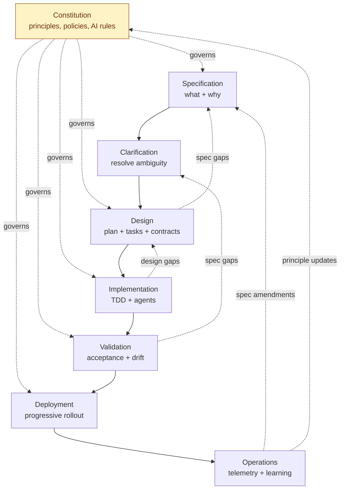
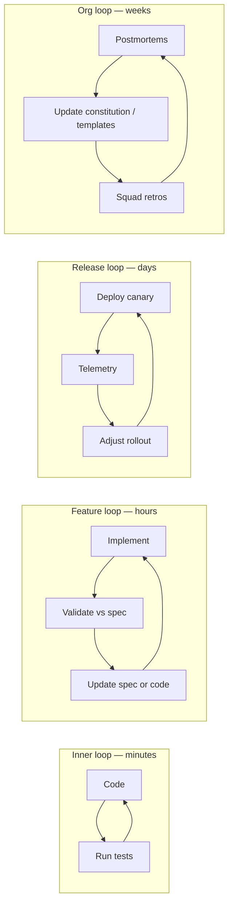

# SDLC Lifecycle

End-to-end flow for the SDD-First SDLC. Each stage has its own deep-dive document linked below.

---

## Table of Contents

1. [At a glance](#at-a-glance)
2. [Stages](#stages)
3. [Lifecycle diagram](#lifecycle-diagram)
4. [Quality gates](#quality-gates)
5. [Feedback loops](#feedback-loops)
6. [Lightweight paths](#lightweight-paths)
7. [Cadence and iteration](#cadence-and-iteration)

---

## At a glance

The lifecycle is **eight stages**, each with explicit inputs, outputs, gates, and owners.

| # | Stage | Primary output | Gate to next stage |
|---|---|---|---|
| 0 | [Constitution](stages/constitution.md) | Versioned principles & policies | Reviewed and ratified |
| 1 | [Specification](stages/specification.md) | Approved feature spec (`spec.md`) | Spec quality checklist passes |
| 2 | [Clarification](stages/clarification.md) | Resolved ambiguity log | Zero open `MUST-CLARIFY` items |
| 3 | [Design](stages/design.md) | Technical design (`design.md`) + task breakdown | Architecture review passes |
| 4 | [Implementation](stages/implementation.md) | Code + unit tests (TDD) | All tasks closed, tests green |
| 5 | [Validation](stages/validation.md) | Acceptance test results, drift report | Acceptance pass + zero drift |
| 6 | [Deployment](stages/deployment.md) | Released artifact, progressive rollout | SLOs healthy, rollout complete |
| 7 | [Operations](stages/operations.md) | Telemetry, postmortems, spec amendments | Lessons folded back into spec/constitution |

Stage 0 is **standing**: the constitution exists once per product/repo and evolves continuously. Stages 1–7 run per feature.

## Stages

Each stage is documented in detail. Click through:

- [Constitution](stages/constitution.md) — principles, AI agent rules, governance
- [Specification](stages/specification.md) — what to build and why
- [Clarification](stages/clarification.md) — eliminate ambiguity before design
- [Design](stages/design.md) — technical plan, contracts, task breakdown
- [Implementation](stages/implementation.md) — TDD-driven build with AI agents
- [Validation](stages/validation.md) — acceptance, quality gates, drift detection
- [Deployment](stages/deployment.md) — progressive delivery, policy enforcement
- [Operations](stages/operations.md) — observability and the learning loop

## Lifecycle diagram

## Quality gates

A **gate** is an automated or human checkpoint that blocks progression. Gates are owned, automatable, and recorded.

| Gate | Type | Owner | What it checks |
|---|---|---|---|
| G0 — Constitution ratified | Human | Architecture Council | Principles approved, policies defined |
| G1 — Spec quality | Hybrid | Product + Tech Lead | Schema valid, acceptance criteria testable, NFRs present |
| G2 — Clarification closed | Automated | Spec platform | Zero open `MUST-CLARIFY` markers |
| G3 — Design review | Human | Architect + Squad | Design matches spec, contracts defined, risks logged |
| G4 — Build complete | Automated | CI | All tasks closed, unit tests green, coverage threshold met |
| G5 — Acceptance pass | Automated | CI + QA | Spec-derived acceptance tests green, drift report clean |
| G6 — Release readiness | Hybrid | Platform + SRE | SLO budget healthy, security scan clean, runbook present |
| G7 — Post-deploy health | Automated | SRE | Error budget intact for N hours, no regressions |

Gates are not bureaucracy. Each gate must run in <1 hour for the standard path or it will be bypassed in practice.

## Feedback loops

The framework defines **four explicit feedback loops** to prevent drift:

Loops are nested: the inner loop must close before the feature loop, the feature loop before the release loop, and the org loop closes over many releases.

## Lightweight paths

Not every change deserves the full eight-stage path. The framework defines three explicit paths:

**Standard path (default).** All eight stages. Used for any change that touches behavior visible to a user, an integrator, or a downstream service.

**Spike path.** Constitution → time-boxed exploration → throwaway. Outputs are a learning memo and (optionally) a seed spec. No production code merges from a spike.

**Patch path.** Used for: typo fixes, dependency bumps, comment edits, pure refactors with full test coverage, hotfixes under incident. Skips Specification/Clarification/Design but still runs through Validation gates and produces a one-paragraph rationale recorded in the PR.

The choice of path is declared in the PR template and is auditable. Abuse of the patch path (e.g., shipping behavior changes as patches) is treated as a process incident.

## Cadence and iteration

The lifecycle is **not a waterfall**. Stages are sized to fit Agile cadences:

- A typical feature spec runs Spec → Validate in 1–3 sprints.
- Constitution amendments are batched monthly; emergency amendments allowed under incident.
- Squads run weekly **spec triage** to keep the spec backlog healthy.
- Architecture Council meets bi-weekly to ratify constitutional changes and review high-impact specs.

The cycle is iterative within stages and across stages. A spec under design that turns out to be flawed loops back to Specification — that is normal and not a failure.

---

[← Overview](../overview.md) · [Next: Constitution →](stages/constitution.md)
