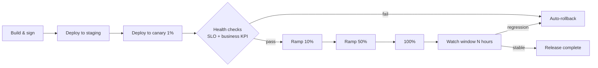

# Etapa 6 — Deployment

Llevar el cambio validado a los usuarios de forma segura, observable y reversible. El Deployment es **progresivo por default**.

---

## Tabla de Contenidos

1. [Propósito](#propósito)
2. [Inputs y outputs](#inputs-y-outputs)
3. [Modelo de entrega progresiva](#modelo-de-entrega-progresiva)
4. [Aplicación de políticas en deploy](#aplicación-de-políticas-en-deploy)
5. [Rollback y kill-switch](#rollback-y-kill-switch)
6. [Quality gate G6](#quality-gate-g6)
7. [Mejores prácticas y anti-patterns](#mejores-prácticas-y-anti-patterns)

---

## Propósito

Entregar el artefacto validado a producción con blast radius controlado, guardrails automatizados y rollout observable. Los modos de fallo de deployment (una regresión que golpea a todos los usuarios al mismo tiempo) se previenen categóricamente por el patrón de rollout, no por esperanza.

## Inputs y outputs

| | |
|---|---|
| **Inputs** | RC validado, deploy spec (perfil de rollout, flags, kill switch), runbook, plan de telemetría |
| **Outputs** | Artefacto liberado, máquina de estado del rollout, registro de salud post-deploy |
| **Dueños** | Platform/SRE (lidera), Squad (responsable), Product (informado para rollouts user-visible) |
| **Cadencia** | Continuo; los rollouts abarcan horas-a-días dependiendo del blast radius |

## Modelo de entrega progresiva

El perfil de rollout por default:

Cada paso de ramp requiere:

- **SLO check** automatizado dentro de tolerancia para la ventana de ramp.
- **Business KPI** check automatizado (el plan de telemetría de la spec define estos).
- Sin nuevo error-budget burn más allá del umbral.

Los ramps se pausan automáticamente al fallar y reanudan solo con acuse de recibo humano más razón registrada.

Para cambios user-visible, un feature flag separa el **deployment** (binario presente en producción) del **release** (los usuarios ven el nuevo comportamiento). La mayoría de los rollouts completan el deployment totalmente antes de voltear los flags.

## Aplicación de políticas en deploy

El pipeline de deploy corre políticas derivadas de la constitution como gates, no avisos:

- Imagen firmada por un builder confiable, SBOM adjunto.
- Sin etiquetas `:latest`. Solo versiones pinned.
- Resource limits configurados; HPA configurado.
- Los dashboards y alertas requeridos existen y están cableados.
- Metadata de clasificación de datos presente para cualquier nuevo schema.
- Clases de CVE no permitidas bloqueadas por política de severidad.
- Manifiestos de breaking-change confirmados contra waivers de contrato.

Las políticas están versionadas junto a la constitution y corren vía el policy engine (p. ej., OPA). Una política fallida detiene el rollout; el bypass requiere aprobador nombrado y justificación con ticket.

## Rollback y kill-switch

Dos mecanismos distintos:

- **Rollback** — re-desplegar el artefacto previo. Usado para regresiones binarias atrapadas durante el ramp. Automatizado donde el SLO se dispara.
- **Kill-switch** — deshabilitar el nuevo comportamiento basado en flag mientras se deja el nuevo binario desplegado. Más rápido, más seguro para bugs de comportamiento que no afectan disponibilidad.

Cada spec debe definir **criterios de revert explícitos** en el plan de rollout ("si X SLI rompe Y por Z minutos, revierte"). El runbook lista los comandos exactos y el blast radius esperado de cada uno.

El rollback se ensaya, no se improvisa. La plataforma corre rollback drills programados.

## Quality gate G6

Pre-deploy, automatizado:

- Todas las verificaciones de política pasan.
- Deploy spec válida (perfil de rollout, configuración de flag, dashboards presentes).
- Runbook presente con criterios de revert explícitos.
- On-call ha acusado recibo de la ventana de rollout para cambios de alto riesgo.

Post-deploy, gateando la finalización del release:

- La ventana de observación pasa con SLOs intactos.
- Sin nuevas alertas en los servicios afectados.
- La telemetría confirma que el business KPI de la spec se mueve en la dirección esperada (o, si no, se abre un issue de investigación).

## Mejores prácticas y anti-patterns

**Mejores prácticas.**

Despliega pequeño y a menudo. El blast radius de un mal cambio escala con cuánto carga cada release. Desacopla deployment de release usando flags para que puedas hacer ramp a nivel de usuario, no solo a nivel de binario. Haz que el rollback sea una operación de un solo botón; si requiere algo más durante un incidente lo lamentarás. Mantén los dashboards en código y aprovisionados por el mismo pipeline que despliega el servicio. Corre rollback drills al menos trimestralmente por servicio.

**Anti-patterns.**

El patrón de "release big-bang del viernes por la tarde" (vivo y bien en muchos lados). Tratar el canary como teatro — desplegando a canary pero auto-promoviendo en un timer fijo independientemente de la señal. Verificaciones manuales de política en revisiones de deploy — los humanos hacen pattern-match mal bajo presión de tiempo. Runbooks que no se han tocado desde que el servicio fue creado. Ventanas de observación largas que nadie realmente observa.

---

[← Validation](validation-sp.md) · [Siguiente: Operations →](operations-sp.md)
