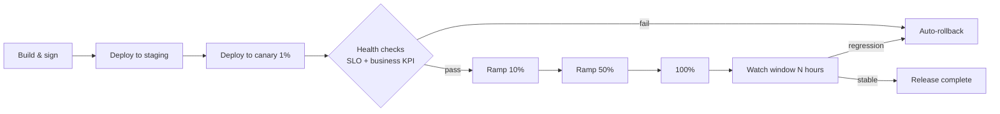

# Stage 6 — Deployment

Get the validated change to users safely, observably, and reversibly. Deployment is **progressive by default**.

---

## Table of Contents

1. [Purpose](#purpose)
2. [Inputs and outputs](#inputs-and-outputs)
3. [Progressive delivery model](#progressive-delivery-model)
4. [Policy enforcement at deploy](#policy-enforcement-at-deploy)
5. [Rollback and kill-switch](#rollback-and-kill-switch)
6. [Quality gate G6](#quality-gate-g6)
7. [Best practices and anti-patterns](#best-practices-and-anti-patterns)

---

## Purpose

Deliver the validated artifact into production with controlled blast radius, automated guardrails, and observable rollout. Deployment failure modes (a regression hitting all users at once) are categorically prevented by the rollout pattern, not by hope.

## Inputs and outputs

| | |
|---|---|
| **Inputs** | Validated RC, deploy spec (rollout profile, flags, kill switch), runbook, telemetry plan |
| **Outputs** | Released artifact, rollout state machine, post-deploy health record |
| **Owners** | Platform/SRE (drives), Squad (accountable), Product (informed for user-visible rollouts) |
| **Cadence** | Continuous; rollouts span hours-to-days depending on blast radius |

## Progressive delivery model

The default rollout profile:

Each ramp step requires:

- Automated **SLO check** within tolerance for the ramp window.
- Automated **business KPI** check (the spec's telemetry plan defines these).
- No new error-budget burn beyond threshold.

Ramps are paused automatically on failure and resume only on human acknowledgement plus reason recorded.

For user-visible changes, a feature flag separates **deployment** (binary present in production) from **release** (users see new behavior). Most rollouts complete deployment fully before flipping flags.

## Policy enforcement at deploy

The deploy pipeline runs constitution-derived policies as gates, not advisories:

- Image signed by a trusted builder, SBOM attached.
- No `:latest` tags. Pinned versions only.
- Resource limits set; HPA configured.
- Required dashboards and alerts exist and are wired.
- Data classification metadata present for any new schemas.
- Disallowed CVE classes blocked by severity policy.
- Breaking-change manifests confirmed against contract waivers.

Policies are versioned alongside the constitution and run via the policy engine (e.g., OPA). A failed policy halts the rollout; bypass requires named approver and ticketed justification.

## Rollback and kill-switch

Two distinct mechanisms:

- **Rollback** — redeploy the prior artifact. Used for binary regressions caught during ramp. Automated where SLO trips.
- **Kill-switch** — flag-based disable of the new behavior while leaving the new binary deployed. Faster, safer for behavior bugs that don't affect availability.

Every spec must define **explicit revert criteria** in the rollout plan ("if X SLI breaches Y for Z minutes, revert"). The runbook lists the exact command(s) and expected blast radius of each.

Rollback is rehearsed, not improvised. The platform runs scheduled rollback drills.

## Quality gate G6

Pre-deploy, automated:

- All policy checks pass.
- Deploy spec valid (rollout profile, flag config, dashboards present).
- Runbook present with explicit revert criteria.
- On-call has acknowledged the rollout window for high-risk changes.

Post-deploy, gating release completion:

- Watch window passes with SLOs intact.
- No new alerts on the affected services.
- Telemetry confirms the spec's business KPI is moving in the expected direction (or, if not, an investigation issue is opened).

## Best practices and anti-patterns

**Best practices.**

Deploy small and often. The blast radius of a bad change scales with how much rides on each release. Decouple deployment from release using flags so you can ramp at user level, not just binary level. Make rollback a one-button operation; if it requires anything more during an incident you'll regret it. Keep dashboards in code and provisioned by the same pipeline that ships the service. Run rollback drills at least quarterly per service.

**Anti-patterns.**

The "Friday afternoon big-bang release" pattern (alive and well in many shops). Treating canary as theatre — deploying to canary but auto-promoting on a fixed timer regardless of signal. Manual policy checks in deploy reviews — humans pattern-match poorly under time pressure. Runbooks that haven't been touched since the service was created. Long watch windows that nobody actually watches.

---

[← Validation](validation.md) · [Next: Operations →](operations.md)
