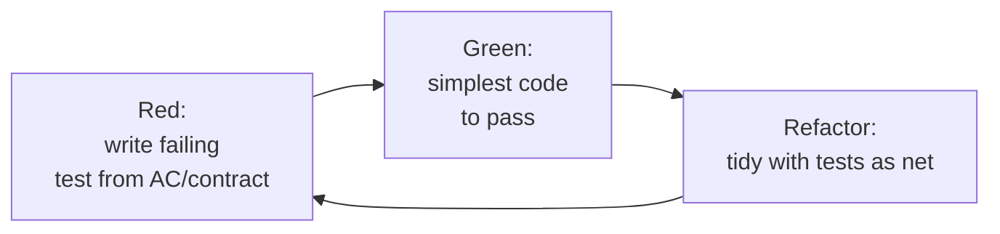
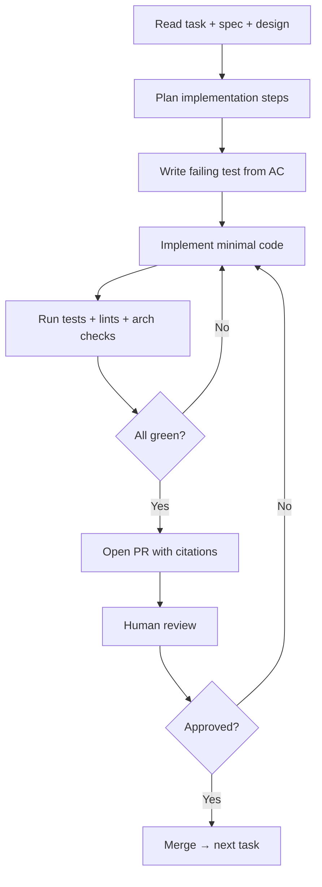

# Etapa 4 — Implementation

La etapa de construcción. **TDD es obligatorio** a nivel unitario; la spec maneja las pruebas de aceptación; los agentes de IA son colaboradores de primera clase dentro de fronteras explícitas.

---

## Tabla de Contenidos

1. [Propósito](#propósito)
2. [Inputs y outputs](#inputs-y-outputs)
3. [El inner loop de TDD](#el-inner-loop-de-tdd)
4. [Pruebas de aceptación derivadas de la spec](#pruebas-de-aceptación-derivadas-de-la-spec)
5. [Flujo del agente de IA](#flujo-del-agente-de-ia)
6. [Code review y merge](#code-review-y-merge)
7. [Quality gate G4](#quality-gate-g4)
8. [Mejores prácticas y anti-patterns](#mejores-prácticas-y-anti-patterns)

---

## Propósito

Convertir el task graph en código entregado que pase cada gate downstream. La spec es read-only en esta etapa *para los ingenieros* — pero si se encuentra que la spec está mal, el regreso a Specification es obligatorio, no opcional.

## Inputs y outputs

| | |
|---|---|
| **Inputs** | `design.md`, `tasks.md`, spec, constitution, schema registry, pruebas existentes |
| **Outputs** | Código, pruebas unitarias (TDD), pruebas de integración, adiciones de pruebas de contrato, docs actualizadas, tareas completadas |
| **Dueños** | Ingenieros del Squad, agentes de IA (bajo revisión), Tech Lead (gate keeper) |
| **Cadencia** | Las tareas están dimensionadas a ≤1 día de esfuerzo; los PRs son pequeños y frecuentes |

## El inner loop de TDD

Dentro de cada tarea, el loop es:



Especifidades en este marco:

- La primera prueba para una tarea se **deriva de un criterio de aceptación o de un contrato**, no inventada desde cero. El enlace de la prueba al spec ID se registra en los metadatos de la prueba para que la plataforma pueda verificar la cobertura.
- **Test first** es el default; desviarse requiere que la tarea esté etiquetada como `tdd-exempt` con razón. CI surface el conteo de exenciones y la tendencia es una métrica de salud del equipo.
- Refactor es un **paso de primera clase**, no opcional. El código red→green sin tocar es la fuente de la mayoría del dolor a largo plazo.
- El inner loop corre localmente y en CI. Las corridas locales <30s para pruebas cambiadas es un objetivo de la plataforma.

## Pruebas de aceptación derivadas de la spec

Cada criterio de aceptación (AC) mapea a una o más pruebas automatizadas:

```ts
// tests/acceptance/upload-resume.spec.ts
import { spec } from "@platform/spec-link";

spec("SPEC-2026-0142", "AC-1", () => {
  it("resumes from last acknowledged chunk within 2s after a 5-minute drop", async () => {
    // Given a 1 GB upload at 50% progress
    // When the network drops for 5 minutes and recovers
    // Then the upload resumes from the last acknowledged chunk within 2s
  });
});
```

El helper `spec()` escribe la procedencia en los metadatos de la prueba para que CI pueda verificar:

- Cada AC tiene al menos una prueba pasando (o un mapeo `pending` explícito y justificado).
- Ningún AC se abandona silenciosamente.

Esto es lo que hace que la spec sea **ejecutable**: la spec maneja la creación y vinculación de pruebas.

## Flujo del agente de IA

Los agentes implementan tareas individuales bajo restricciones explícitas establecidas en la constitution. El loop estándar de agente:



Reglas del agente (aplicadas por el agent runner, no consultivas):

- Los agentes no pueden mergear a main. Mergear requiere un aprobador humano.
- Cada PR cita el task ID, spec ID y las cláusulas constitucionales aplicadas.
- Los agentes se detienen y preguntan si detectan un conflicto spec/design, contexto faltante, o un `MUST-CLARIFY` que descubrieron al implementar.
- Los agentes registran cada tool call. El PR incluye un breve "agent trail" — qué tools usó el agente, qué archivos tocó.
- Los agentes no pueden modificar pruebas autoradas por humanos sin aprobación explícita; pueden agregar nuevas pruebas.

Los agentes son más efectivos en:

- Tareas mecánicas (scaffolding, schema migrations, conversiones de DTO, plomería de telemetría).
- Tareas con contratos bien definidos y criterios de aceptación claros.
- Refactors con cobertura sólida de pruebas.

Los agentes son menos efectivos (y más peligrosos) en:

- Preocupaciones cross-cutting novedosas.
- Trabajo de performance sin un profiler en el loop.
- Código crítico de seguridad (escape, auth, crypto).

La constitution lista paths "solo-humanos" explícitos.

## Code review y merge

Cada PR — humano o agente — debe:

- Referenciar su tarea y spec.
- Mostrar CI pasando: unit, integration, contract, lint, arch checks, type checks, security scan.
- Mostrar el delta de cobertura en líneas cambiadas (≥ umbral de la constitution).
- Tener al menos un aprobador humano. Para PRs autorados por agentes, el aprobador no puede ser el prompter del agente (separación de funciones).
- Pasar el **drift check**: spec-binding, compatibilidad de contrato, sincronización del schema-registry.

Las revisiones se enfocan en intención y riesgo, no en formato (los formateadores son obligatorios y corren pre-commit). Los revisores verifican explícitamente: ¿el código hace lo que dice la spec? ¿Las pruebas están probando la spec, no la implementación? ¿Los modos de fallo están manejados?

## Quality gate G4

Automatizado, sin override humano a nivel de build (los humanos hacen gate en design y validation, no aquí):

- Todas las tareas para la spec están cerradas.
- Cada tarea cerrada tiene al menos un PR enlazado.
- Las pruebas unitarias/de integración pasan.
- Las pruebas de contrato pasan.
- Los lints arquitectónicos pasan (aplicados por la constitution).
- El delta de cobertura cumple el umbral.
- Sin etiquetas `tdd-exempt` sin justificación registrada.

## Mejores prácticas y anti-patterns

**Mejores prácticas.**

Mantén los PRs pequeños (≤300 líneas de diff es un buen límite superior). Corre la primera pasada del agente en scaffolding mientras un humano toma las decisiones de diseño más difíciles en paralelo. Empareja agentes con humanos en trabajo novedoso — el agente redacta; el humano dirige. Usa property-based tests para invariantes declarados en NFRs (gran señal-a-ruido). Haz del tiempo de espera del inner-loop una métrica a nivel de equipo; los inner loops largos matan la adopción de TDD más rápido que cualquier política.

**Anti-patterns.**

"Teatro de TDD" — escribir la prueba después del código y fingir. Suites de pruebas solo de snapshots que no afirman nada significativo. Dejar que los agentes mergeen su propio trabajo. Dejar que los agentes escriban pruebas de aceptación *y* el código que las satisface en el mismo loop sin revisión humana (riesgo de colusión). Saltarse el refactor porque "regresaremos a eso" — no lo harás, y el siguiente agente hará pattern-match al desorden.

---

[← Design](design-sp.md) · [Siguiente: Validation →](validation-sp.md)
