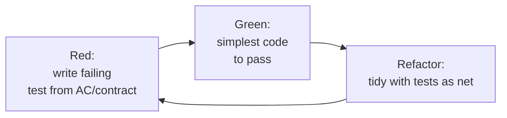
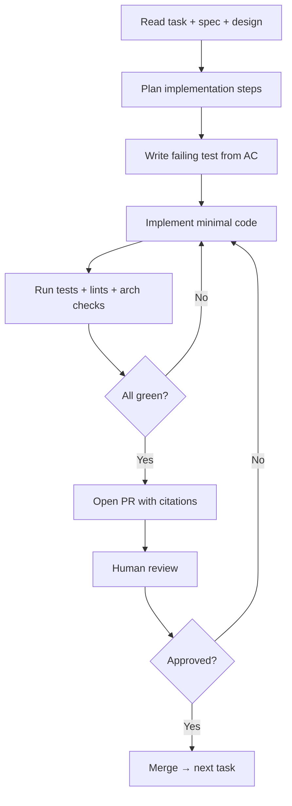

# Stage 4 — Implementation

The build stage. **TDD is mandatory** at the unit level; the spec drives acceptance tests; AI agents are first-class collaborators inside explicit boundaries.

---

## Table of Contents

1. [Purpose](#purpose)
2. [Inputs and outputs](#inputs-and-outputs)
3. [The TDD inner loop](#the-tdd-inner-loop)
4. [Spec-derived acceptance tests](#spec-derived-acceptance-tests)
5. [AI agent workflow](#ai-agent-workflow)
6. [Code review and merge](#code-review-and-merge)
7. [Quality gate G4](#quality-gate-g4)
8. [Best practices and anti-patterns](#best-practices-and-anti-patterns)

---

## Purpose

Turn the task graph into shipped code that passes every gate downstream. The spec is read-only at this stage *for engineers* — but if the spec is found to be wrong, the loop back to Specification is mandatory, not optional.

## Inputs and outputs

| | |
|---|---|
| **Inputs** | `design.md`, `tasks.md`, spec, constitution, schema registry, existing tests |
| **Outputs** | Code, unit tests (TDD), integration tests, contract test additions, updated docs, completed tasks |
| **Owners** | Squad engineers, AI agents (under review), Tech Lead (gate keeper) |
| **Cadence** | Tasks are sized to ≤1 day of effort; PRs are small and frequent |

## The TDD inner loop

Inside each task, the loop is:



Specifics in this framework:

- The first test for a task is **derived from an acceptance criterion or a contract**, not invented from scratch. The link from test to spec ID is recorded in test metadata so the platform can verify coverage.
- **Test first** is the default; deviating requires the task to be tagged `tdd-exempt` with reason. CI surfaces the count of exemptions and the trend is a team-health metric.
- Refactor is a **first-class step**, not optional. Untouched red→green code is the source of most long-term pain.
- The inner loop runs locally and on CI. Local runs <30s for changed tests is a platform target.

## Spec-derived acceptance tests

Each acceptance criterion (AC) maps to one or more automated tests:

```ts
// tests/acceptance/upload-resume.spec.ts
import { spec } from "@platform/spec-link";

spec("SPEC-2026-0142", "AC-1", () => {
  it("resumes from last acknowledged chunk within 2s after a 5-minute drop", async () => {
    // Given a 1 GB upload at 50% progress
    // When the network drops for 5 minutes and recovers
    // Then the upload resumes from the last acknowledged chunk within 2s
  });
});
```

The `spec()` helper writes provenance into the test metadata so CI can verify:

- Every AC has at least one passing test (or an explicit, justified `pending` mapping).
- No AC is silently abandoned.

This is what makes the spec **executable**: the spec drives test creation and binding.

## AI agent workflow

Agents implement individual tasks under explicit constraints set in the constitution. The standard agent loop:



Agent rules (enforced by the agent runner, not advisory):

- Agents may not merge to main. Merge requires a human approver.
- Every PR cites the task ID, spec ID, and constitutional clauses applied.
- Agents stop and ask if they detect a spec/design conflict, missing context, or a `MUST-CLARIFY` they uncovered while implementing.
- Agents log every tool call. The PR includes a brief "agent trail" — what tools the agent used, what files it touched.
- Agents may not modify tests authored by humans without explicit approval; they may add new tests.

Agents are most effective on:

- Mechanical tasks (scaffolding, schema migrations, DTO conversions, telemetry plumbing).
- Tasks with well-defined contracts and clear acceptance criteria.
- Refactors with strong test coverage.

Agents are least effective (and most dangerous) on:

- Novel cross-cutting concerns.
- Performance work without a profiler in the loop.
- Security-critical code (escape, auth, crypto).

The constitution lists explicit "human-only" paths.

## Code review and merge

Every PR — human or agent — must:

- Reference its task and spec.
- Show passing CI: unit, integration, contract, lint, arch checks, type checks, security scan.
- Show coverage delta on changed lines (≥ constitution threshold).
- Have at least one human approver. For agent-authored PRs, the approver may not be the agent's prompter (separation of duties).
- Pass the **drift check**: spec-binding, contract compatibility, schema-registry sync.

Reviews focus on intent and risk, not formatting (formatters are mandatory and run pre-commit). Reviewers explicitly check: does the code do what the spec says? Are the tests testing the spec, not the implementation? Are the failure modes handled?

## Quality gate G4

Automated, with no human override at the build level (humans gate at design and validation, not here):

- All tasks for the spec are closed.
- Every closed task has at least one PR linked.
- Unit/integration tests pass.
- Contract tests pass.
- Architectural lints pass (constitution-enforced).
- Coverage delta meets threshold.
- No `tdd-exempt` tags without recorded justification.

## Best practices and anti-patterns

**Best practices.**

Keep PRs small (≤300 lines diff is a good upper bound). Run the agent's first pass on scaffolding while a human takes the harder design choices in parallel. Pair agents with humans on novel work — the agent drafts; the human steers. Use property-based tests for invariants stated in NFRs (great signal-to-noise). Make the inner-loop wait time a team-level metric; long inner loops kill TDD adoption faster than any policy.

**Anti-patterns.**

"TDD theatre" — writing the test after the code and pretending. Snapshot-only test suites that assert nothing meaningful. Letting agents merge their own work. Letting agents write acceptance tests *and* the code that satisfies them in the same loop without human review (collusion risk). Skipping refactor because "we'll come back to it" — you won't, and the next agent will pattern-match the mess.

---

[← Design](design.md) · [Next: Validation →](validation.md)
