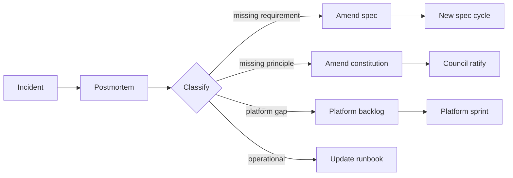

# Etapa 7 — Operations

Operations cierra el loop más externo. Produce la señal que fluye de regreso a las specs, la constitution y la plataforma.

---

## Tabla de Contenidos

1. [Propósito](#propósito)
2. [Inputs y outputs](#inputs-y-outputs)
3. [Requisitos de observabilidad](#requisitos-de-observabilidad)
4. [Loop de incidente → enmienda de spec](#loop-de-incidente--enmienda-de-spec)
5. [Salud continua de la spec](#salud-continua-de-la-spec)
6. [Quality gate G7](#quality-gate-g7)
7. [Mejores prácticas y anti-patterns](#mejores-prácticas-y-anti-patterns)

---

## Propósito

Correr el sistema; aprender de cómo se comporta; alimentar el aprendizaje de regreso a la spec, la constitution y la plataforma. Operations no es el final del lifecycle — es la fuente de la siguiente iteración.

## Inputs y outputs

| | |
|---|---|
| **Inputs** | Telemetría en vivo, feedback de usuarios, incidentes, carga de soporte, métricas de costo |
| **Outputs** | Postmortems, enmiendas a specs, enmiendas a la constitution, mejoras a la plataforma, specs retiradas |
| **Dueños** | SRE (lidera observabilidad), Squad (responsable de servicios propios), Product (consume señal del usuario), CX (cierra el loop de feedback del usuario) |
| **Cadencia** | Continuo |

## Requisitos de observabilidad

Cada feature enviada debe venir con:

- **SLIs y SLOs** para el comportamiento user-visible (no solo salud del sistema).
- **Dashboards** enlazados desde la spec — auto-generados donde sea posible.
- **Alertas** cableadas al error-budget burn y a los KPIs de negocio definidos en la spec.
- **Traces** propagados a través de los paths afectados, con sampling que sobreviva al volumen de producción.
- **Logs** con contexto estructurado (spec ID, request ID, tenant ID, estado del feature flag).

La constitution define el mínimo; las specs pueden subirlo. La etapa de validation ya verificó que estos están presentes en release; operations verifica que sigan siendo útiles a medida que el sistema evoluciona.

## Loop de incidente → enmienda de spec

Cuando algo sale mal en producción, el marco lo trata como **feedback de spec de primera clase**:

Cada postmortem cierra con un conjunto clasificado de action items. "Acción: ser más cuidadoso" no se permite; cada acción aterriza en spec, constitution, runbook o platform.

La plataforma rastrea la tasa de conversión de acciones de postmortem en enmiendas mergeadas — una acción estancada por más de 60 días es en sí misma un incidente.

## Salud continua de la spec

Una spec está **viva** mientras la feature esté en producción. La plataforma corre verificaciones continuas:

- **Telemetría vs spec** — ¿el comportamiento en vivo todavía satisface los NFRs que la spec prometió? Drift de NFR (p. ej., latencia subiendo) abre un issue de salud de spec.
- **Uso vs supuestos de la spec** — los supuestos escritos en la spec están etiquetados; si los datos de uso contradicen un supuesto, la spec se marca para revisión.
- **Dependencia vs spec** — cuando una dependencia en la que la spec se basaba cambia su contrato o comportamiento, la spec se marca.

Las specs también pueden ser **retiradas**. Cuando una feature se remueve, su spec se mueve a status `retired` con un enlace a la spec de deprecación. Las specs retiradas siguen siendo buscables y trazables.

## Quality gate G7

Post-deploy, aplicado a través de la ventana de observación:

- Error-budget burn dentro de tolerancia.
- Sin regresión en los KPIs de negocio definidos en la spec.
- Sin nuevos incidentes SEV-1/2 trazables al cambio.
- Toda la telemetría (counters, traces, logs) emitiendo como la spec prometió.

Si G7 falla, el rollout se revierte o el kill switch se voltea, se abre un incidente, y se revisita la tripleta spec/code/operations.

## Mejores prácticas y anti-patterns

**Mejores prácticas.**

Trata la spec como documentación viva, no una lápida. Cablea los loops de feedback de usuarios (soporte, feedback in-product, investigación de CX) al mismo backlog que la señal de ingeniería — la mayoría de los "bugs" de producción son en realidad requisitos perdidos. Corre revisiones trimestrales de spec por servicio: qué specs están stale, qué supuestos ya no son ciertos, qué features no se usan. Haz que la plataforma — no los individuos — sea responsable de notar el drift.

**Anti-patterns.**

Postmortems cuyas acciones mueren en una página de Confluence que nadie lee. SLOs que nunca se actualizan a medida que el sistema crece. Tratar operations como algo que sucede después de que termina el SDLC — es el SDLC, en estado estable. Dejar que la salud de la spec se pudra porque el autor original se fue; las transferencias de propiedad deben ser explícitas, no asumidas.

---

[← Deployment](deployment-sp.md) · [Volver al Lifecycle ↑](../lifecycle-sp.md)
