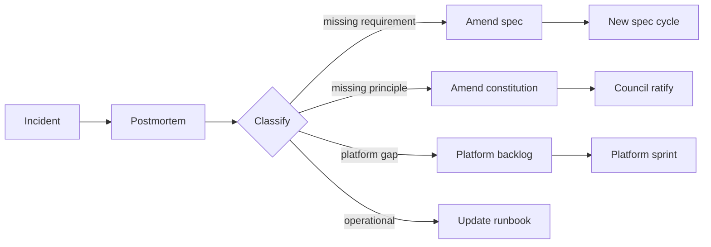

# Stage 7 — Operations

Operations closes the outermost loop. It produces the signal that flows back into specs, the constitution, and the platform.

---

## Table of Contents

1. [Purpose](#purpose)
2. [Inputs and outputs](#inputs-and-outputs)
3. [Observability requirements](#observability-requirements)
4. [Incident → spec amendment loop](#incident--spec-amendment-loop)
5. [Continuous spec health](#continuous-spec-health)
6. [Quality gate G7](#quality-gate-g7)
7. [Best practices and anti-patterns](#best-practices-and-anti-patterns)

---

## Purpose

Run the system; learn from how it behaves; feed the learning back into the spec, the constitution, and the platform. Operations is not the end of the lifecycle — it is the source of the next iteration.

## Inputs and outputs

| | |
|---|---|
| **Inputs** | Live telemetry, user feedback, incidents, support load, cost metrics |
| **Outputs** | Postmortems, spec amendments, constitution amendments, platform improvements, retired specs |
| **Owners** | SRE (drives observability), Squad (accountable for owned services), Product (consumes user signal), CX (closes user-feedback loop) |
| **Cadence** | Continuous |

## Observability requirements

Each shipped feature must come with:

- **SLIs and SLOs** for the user-visible behavior (not just system health).
- **Dashboards** linked from the spec — automatically generated where possible.
- **Alerts** wired to error-budget burn and to spec-defined business KPIs.
- **Traces** propagated through the affected paths, with sampling that survives at production volume.
- **Logs** with structured context (spec ID, request ID, tenant ID, feature flag state).

The constitution defines the minimum bar; specs may raise it. The validation stage already verified these are present at release; operations verifies they remain useful as the system evolves.

## Incident → spec amendment loop

When something goes wrong in production, the framework treats it as **first-class spec feedback**:

Every postmortem closes with a classified set of action items. "Action: be more careful" is not allowed; every action either lands in spec, constitution, runbook, or platform.

The platform tracks the conversion rate of postmortem actions into merged amendments — a stalled action older than 60 days is itself an incident.

## Continuous spec health

A spec is **alive** as long as the feature is in production. The platform runs continuous checks:

- **Telemetry vs spec** — does the live behavior still satisfy the NFRs the spec promised? Drift from NFR (e.g., latency creeping up) opens a spec health issue.
- **Usage vs spec assumptions** — assumptions written into the spec are tagged; if usage data contradicts an assumption, the spec is flagged for review.
- **Dependency vs spec** — when a dependency the spec relied on changes contract or behavior, the spec is flagged.

Specs can also be **retired**. When a feature is removed, its spec moves to `retired` status with a link to the deprecation spec. Retired specs remain searchable and traceable.

## Quality gate G7

Post-deploy, applied across the watch window:

- Error-budget burn within tolerance.
- No regression in spec-defined business KPIs.
- No new SEV-1/2 incidents traceable to the change.
- All telemetry (counters, traces, logs) emitting as the spec promised.

If G7 fails, the rollout is rolled back or the kill switch flipped, an incident is opened, and the spec/code/operations triplet is revisited.

## Best practices and anti-patterns

**Best practices.**

Treat the spec as living documentation, not a tombstone. Wire user-feedback loops (support, in-product feedback, CX research) into the same backlog as engineering signal — most production "bugs" are actually missed requirements. Run quarterly spec reviews per service: which specs are stale, which assumptions are no longer true, which features are unused. Make the platform — not individuals — responsible for noticing drift.

**Anti-patterns.**

Postmortems whose actions die in a Confluence page nobody reads. SLOs that are never updated as the system grows. Treating operations as something that happens after the SDLC ends — it is the SDLC, in steady state. Letting spec health rot because the original author left; ownership transfers must be explicit, not assumed.

---

[← Deployment](deployment.md) · [Back to Lifecycle ↑](../lifecycle.md)
