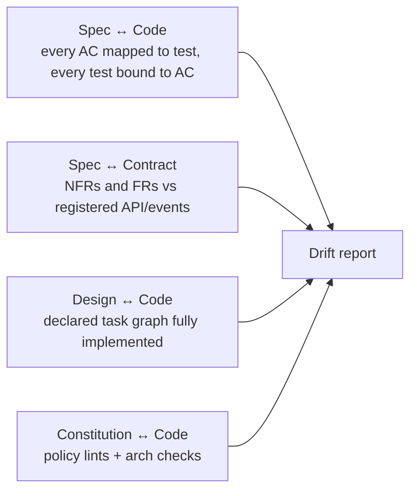

# Etapa 5 — Validation

La Validation cierra el loop entre **lo que se especificó** y **lo que se construyó**. Es donde se detecta el drift, se registra la aceptación y se establece la disposición para release.

---

## Tabla de Contenidos

1. [Propósito](#propósito)
2. [Inputs y outputs](#inputs-y-outputs)
3. [Qué se valida](#qué-se-valida)
4. [Detección de drift](#detección-de-drift)
5. [Validación no-funcional](#validación-no-funcional)
6. [Quality gate G5](#quality-gate-g5)
7. [Mejores prácticas y anti-patterns](#mejores-prácticas-y-anti-patterns)

---

## Propósito

Verificar, no probar. Las pruebas corren continuamente durante implementación; la validation es el momento en que la plataforma afirma: *cada requisito de la spec tiene evidencia correspondiente de corrección, cada criterio de aceptación se satisface, ningún contrato se rompió silenciosamente, ninguna regla constitucional se violó.*

También es la etapa donde los humanos (QA, CX, Product) explícitamente aceptan el trabajo.

## Inputs y outputs

| | |
|---|---|
| **Inputs** | Código mergeado, todas las pruebas, contratos, instrumentación de telemetría, runbook, la spec |
| **Outputs** | Reporte de validation (legible por máquina + humano), reporte de drift, signoffs de aceptación, release candidate |
| **Dueños** | QA (lidera), Tech Lead, Product, CX/UX (para user-facing), SRE (para NFRs y operabilidad) |
| **Cadencia** | Por spec; corre en CI sobre el build RC; signoff humano en 1–3 días hábiles del RC |

## Qué se valida

Cinco categorías, cada una automatizada cuando es posible:

1. **Aceptación funcional.** Cada AC en la spec tiene al menos una prueba automatizada pasando. El reporte de validation lista el mapeo AC → test con status.
2. **Compatibilidad de contrato.** Las APIs públicas, eventos y schemas se verifican para retro-compatibilidad contra el registry. Los breaking changes requieren waivers explícitos.
3. **Adherencia no-funcional.** Los objetivos de carga, latencia, tasa de errores y recursos de los NFRs se ejercitan y verifican.
4. **Cumplimiento con la constitution.** Lints arquitectónicos, scans de seguridad, y verificaciones de políticas pasan. Los waivers se listan.
5. **Operabilidad.** Runbook presente y existen enlaces a dashboards; on-call está briefeado; alertas cableadas a la telemetría que la spec pidió.

El reporte de validation es generado por la plataforma a partir de datos reales, no un documento de prosa que un humano escribe a mano.

## Detección de drift

El drift es el asesino silencioso de SDD. La plataforma corre cuatro verificaciones de drift:



La salida es un reporte estructurado:

```yaml
spec: SPEC-2026-0142
generated_at: 2026-04-30T18:42:00Z
status: clean   # clean | warnings | fail
issues:
  - severity: warning
    kind: ac-coverage
    detail: AC-5 has only one test; load test missing per NFR-2
  - severity: fail
    kind: contract-compat
    detail: 'POST /uploads/resume changed response schema (semver: major)'
```

Cualquier `fail` bloquea G5. Los `warnings` bloquean release para cambios que tocan principios constitucionales o contratos públicos.

## Validación no-funcional

Los NFRs se validan en corridas dedicadas, no como parte de pruebas unit/integration:

- **Carga y performance.** Un escenario scripteado por NFR relevante; los resultados comparados contra los objetivos declarados de la spec. La tendencia se rastrea a través de releases.
- **Resiliencia.** Donde la spec lo pide, los chaos drills (latencia inducida, fallo de dependencia) verifican la degradación elegante.
- **Seguridad.** SAST + DAST dirigido + dep scan. Los flujos relevantes para la spec (auth, manejo de secretos) se ejercitan.
- **Accesibilidad.** Para superficies user-facing, verificaciones automatizadas de WCAG más una revisión humana puntual por CX/UX.
- **Observabilidad.** Afirma que la telemetría que la spec prometió realmente se emite (nombres de contadores, cardinalidad de etiquetas, traces presentes).

Las corridas de NFR son costosas; la plataforma las programa en builds RC, no en cada PR. CI a nivel de PR corre proxies más baratos (un small load smoke, a11y a nivel lint).

## Quality gate G5

Verificaciones automatizadas que **deben** pasar:

- Status del reporte de drift = clean (o warnings explícitamente waiveados).
- Cada AC tiene ≥1 prueba pasando en la última corrida de CI sobre el RC.
- Compat de contrato limpio o waiver de breaking-change mergeado.
- Las corridas de NFR dentro de las tolerancias declaradas de la spec.
- Scan de seguridad limpio o hallazgos triageados con dueño + fecha de vencimiento.

Signoffs humanos:

- QA: reporte de validation revisado.
- Product: aceptación registrada contra la spec.
- CX/UX: verificación de usabilidad para cambios user-facing.
- SRE: checklist de operabilidad completo.
- Architect: solo si es cross-service o contract-breaking.

Los signoffs se registran contra el registro de la spec, no en chat. El status de la spec se mueve de `implementing` → `validated`.

## Mejores prácticas y anti-patterns

**Mejores prácticas.**

Genera el reporte de validation desde la plataforma; nunca dejes que los humanos lo escriban a mano. Trata el drift como un defecto, no un issue de documentación — abre un bug, arréglalo, luego re-corre G5. Corre la validación de NFR tan pronto como el design produzca suficiente superficie para instrumentar; no la guardes para el final. Haz que el reporte de validation sea parte del release notes — es el changelog más honesto que producirás.

**Anti-patterns.**

"La validation es problema de QA" — la validation es responsabilidad a nivel de squad; QA acelera, no reemplaza. Esconder fallos de NFR detrás de un waiver cada vez — el conteo de waivers es en sí mismo una métrica. Dejar que el drift se acumule "lo arreglaremos después del release" — el drift compone, y el arreglo se empaqueta con nuevo trabajo que muta la superficie nuevamente. Tratar el signoff de CX/UX como un sello de goma; una verificación puntual real de usabilidad atrapa cosas que las herramientas automatizadas pierden.

---

[← Implementation](implementation-sp.md) · [Siguiente: Deployment →](deployment-sp.md)
