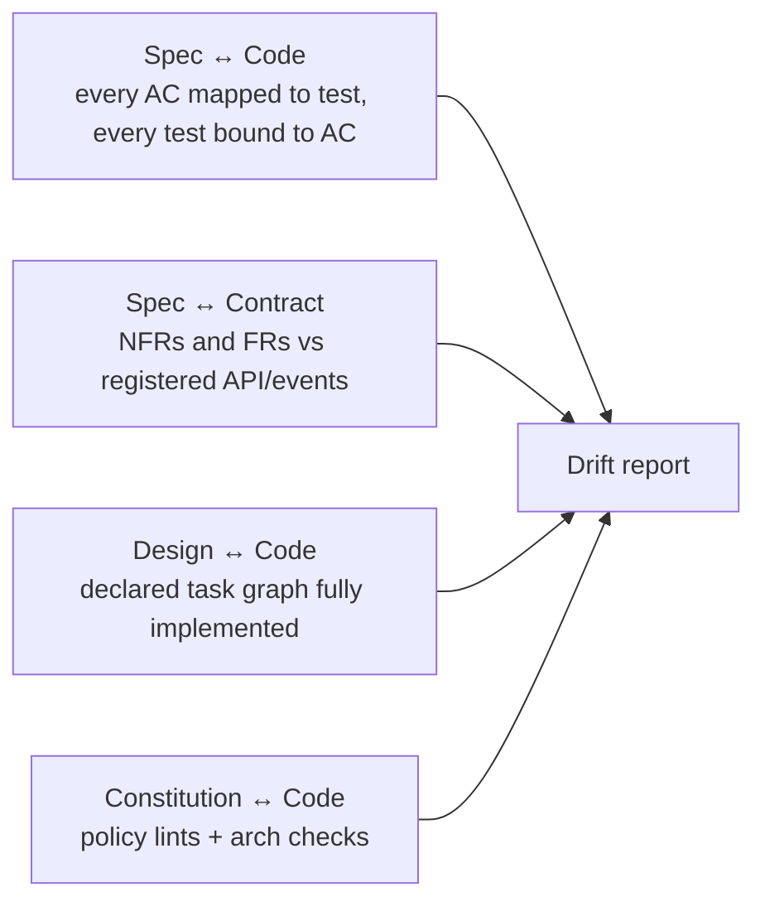

# Stage 5 — Validation

Validation closes the loop between **what was specified** and **what was built**. It is where drift is detected, acceptance is recorded, and release readiness is established.

---

## Table of Contents

1. [Purpose](#purpose)
2. [Inputs and outputs](#inputs-and-outputs)
3. [What gets validated](#what-gets-validated)
4. [Drift detection](#drift-detection)
5. [Non-functional validation](#non-functional-validation)
6. [Quality gate G5](#quality-gate-g5)
7. [Best practices and anti-patterns](#best-practices-and-anti-patterns)

---

## Purpose

Verify, not test. Tests run continuously through implementation; validation is the moment the platform asserts: *every spec requirement has corresponding evidence of correctness, every acceptance criterion is satisfied, no contract has been silently broken, no constitutional rule has been violated.*

It is also the stage where humans (QA, CX, Product) explicitly accept the work.

## Inputs and outputs

| | |
|---|---|
| **Inputs** | Merged code, all tests, contracts, telemetry instrumentation, runbook, the spec |
| **Outputs** | Validation report (machine + human-readable), drift report, acceptance signoffs, release candidate |
| **Owners** | QA (drives), Tech Lead, Product, CX/UX (for user-facing), SRE (for NFRs and operability) |
| **Cadence** | Per spec; runs in CI on RC build; human signoff within 1–3 business days of RC |

## What gets validated

Five categories, each automated where possible:

1. **Functional acceptance.** Every AC in the spec has at least one passing automated test. The validation report lists AC → test mapping with status.
2. **Contract compatibility.** Public APIs, events, and schemas are checked for backward compatibility against the registry. Breaking changes require explicit waivers.
3. **Non-functional adherence.** Load, latency, error-rate, and resource targets from NFRs are exercised and verified.
4. **Constitution compliance.** Architectural lints, security scans, and policy checks pass. Waivers are listed.
5. **Operability.** Runbook present and links to dashboards exist; on-call is briefed; alerts wired to telemetry the spec asked for.

The validation report is generated by the platform from real data, not a prose document a human writes by hand.

## Drift detection

Drift is the silent killer of SDD. The platform runs four drift checks:



Output is a structured report:

```yaml
spec: SPEC-2026-0142
generated_at: 2026-04-30T18:42:00Z
status: clean   # clean | warnings | fail
issues:
  - severity: warning
    kind: ac-coverage
    detail: AC-5 has only one test; load test missing per NFR-2
  - severity: fail
    kind: contract-compat
    detail: 'POST /uploads/resume changed response schema (semver: major)'
```

Any `fail` blocks G5. `warnings` block release for changes touching constitutional principles or public contracts.

## Non-functional validation

NFRs are validated in dedicated runs, not as part of unit/integration tests:

- **Load and performance.** A scripted scenario per relevant NFR; results compared against the spec's stated targets. Trend is tracked across releases.
- **Resilience.** Where the spec calls for it, chaos drills (induced latency, dependency failure) verify graceful degradation.
- **Security.** SAST + targeted DAST + dependency scan. Spec-relevant flows (auth, secret handling) are exercised.
- **Accessibility.** For user-facing surfaces, automated WCAG checks plus a human spot-check by CX/UX.
- **Observability.** Asserts that the telemetry the spec promised is actually emitted (counter names, label cardinality, traces present).

NFR runs are expensive; the platform schedules them on RC builds, not every PR. PR-level CI runs cheaper proxies (a small load smoke, lint-level a11y).

## Quality gate G5

Automated checks that **must** pass:

- Drift report status = clean (or warnings explicitly waived).
- Every AC has ≥1 passing test in the latest CI run on the RC.
- Contract compat clean or breaking-change waiver merged.
- NFR runs within the spec's stated tolerances.
- Security scan clean or findings triaged with owner + due date.

Human signoffs:

- QA: validation report reviewed.
- Product: acceptance recorded against the spec.
- CX/UX: usability check for user-facing changes.
- SRE: operability checklist complete.
- Architect: only if cross-service or contract-breaking.

Signoffs are recorded against the spec record, not in chat. The spec status moves from `implementing` → `validated`.

## Best practices and anti-patterns

**Best practices.**

Generate the validation report from the platform; never let humans hand-write it. Treat drift as a defect, not a documentation issue — open a bug, fix it, then re-run G5. Run NFR validation as early as the design produces enough surface to instrument; don't save it for the end. Make the validation report part of the release notes — it is the most honest changelog you'll ever produce.

**Anti-patterns.**

"Validation is QA's problem" — validation is owned at the squad level; QA accelerates, doesn't replace it. Hiding NFR misses behind a waiver every time — the waiver count is itself a metric. Letting drift accumulate "we'll fix it after release" — drift compounds, and the fix gets bundled with new work that mutates the surface again. Treating CX/UX signoff as a rubber stamp; a real usability spot-check catches things automated tools miss.

---

[← Implementation](implementation.md) · [Next: Deployment →](deployment.md)
